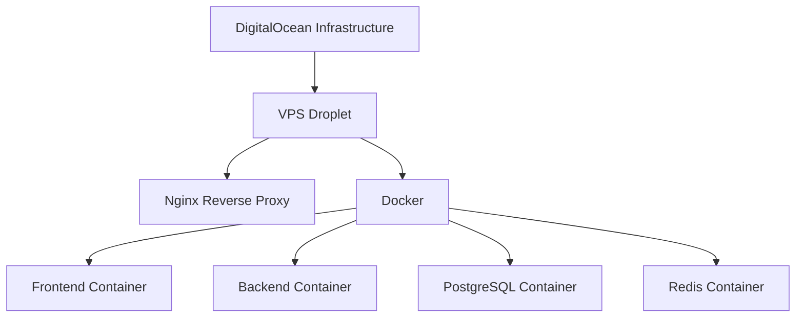

I'll help you design a comprehensive deployment flow for your application on DigitalOcean. Here's a detailed breakdown:

### 1. Infrastructure Setup



### 2. Domain & DNS Configuration
```plaintext
example.com
├── dev.example.com -> Development Environment
└── example.com -> Production Environment
```

### 3. Repository Structure
```
project/
├── frontend/
│   ├── Dockerfile
│   └── .env.{development,production}
├── backend/
│   ├── Dockerfile
│   └── .env.{development,production}
├── nginx/
│   └── nginx.conf
├── docker-compose.yml
└── scripts/
    ├── deploy-dev.sh
    └── deploy-prod.sh
```

### 4. GitHub Actions Workflow

**Development Workflow** (.github/workflows/dev-deploy.yml)
```yaml
name: Development Deployment

on:
  push:
    branches:
      - develop

jobs:
  deploy:
    runs-on: ubuntu-latest
    steps:
      - name: Checkout code
        uses: actions/checkout@v2

      - name: Deploy to Development
        uses: appleboy/ssh-action@master
        with:
          host: ${{ secrets.DO_HOST }}
          username: ${{ secrets.DO_USERNAME }}
          key: ${{ secrets.DO_SSH_KEY }}
          script: |
            cd /opt/app
            ./scripts/deploy-dev.sh
```

**Production Workflow** (.github/workflows/prod-deploy.yml)
```yaml
name: Production Deployment

on:
  push:
    tags:
      - 'v*'

jobs:
  deploy:
    runs-on: ubuntu-latest
    steps:
      - name: Checkout code
        uses: actions/checkout@v2

      - name: Deploy to Production
        uses: appleboy/ssh-action@master
        with:
          host: ${{ secrets.DO_HOST }}
          username: ${{ secrets.DO_USERNAME }}
          key: ${{ secrets.DO_SSH_KEY }}
          script: |
            cd /opt/app
            ./scripts/deploy-prod.sh
```

### 5. Deployment Scripts

**deploy-dev.sh**
```bash
#!/bin/bash

# Pull latest changes
git pull origin develop

# Load development environment variables
set -a
source .env.development
set +a

# Build and deploy containers
docker-compose -f docker-compose.yml -f docker-compose.dev.yml down
docker-compose -f docker-compose.yml -f docker-compose.dev.yml build
docker-compose -f docker-compose.yml -f docker-compose.dev.yml up -d

# Run migrations
docker-compose exec backend npm run migrate
```

**deploy-prod.sh**
```bash
#!/bin/bash

# Pull latest changes
git fetch --tags
git checkout $(git describe --tags --abbrev=0)

# Load production environment variables
set -a
source .env.production
set +a

# Build and deploy containers
docker-compose -f docker-compose.yml -f docker-compose.prod.yml down
docker-compose -f docker-compose.yml -f docker-compose.prod.yml build
docker-compose -f docker-compose.yml -f docker-compose.prod.yml up -d

# Run migrations
docker-compose exec backend npm run migrate
```

### 6. Docker Compose Configuration

```yaml
version: '3.8'

services:
  frontend:
    build: ./frontend
    restart: always
    depends_on:
      - backend

  backend:
    build: ./backend
    restart: always
    depends_on:
      - postgres
      - redis

  postgres:
    image: postgres:13
    volumes:
      - postgres_data:/var/lib/postgresql/data
    environment:
      POSTGRES_DB: ${DB_NAME}
      POSTGRES_USER: ${DB_USER}
      POSTGRES_PASSWORD: ${DB_PASSWORD}

  redis:
    image: redis:6
    volumes:
      - redis_data:/data

  nginx:
    image: nginx:alpine
    ports:
      - "80:80"
      - "443:443"
    volumes:
      - ./nginx/nginx.conf:/etc/nginx/nginx.conf
      - ./certbot/conf:/etc/letsencrypt
      - ./certbot/www:/var/www/certbot

volumes:
  postgres_data:
  redis_data:
```

### 7. Nginx Configuration

```nginx
server {
    listen 80;
    server_name dev.example.com;

    location / {
        proxy_pass http://frontend:3000;
        proxy_set_header Host $host;
        proxy_set_header X-Real-IP $remote_addr;
    }

    location /api {
        proxy_pass http://backend:1337;
        proxy_set_header Host $host;
        proxy_set_header X-Real-IP $remote_addr;
    }
}

server {
    listen 80;
    server_name example.com;
    # Similar configuration for production
}
```

### 8. Security Considerations

1. SSL/TLS certificates using Let's Encrypt
2. Environment variables stored as GitHub Secrets
3. Firewall rules on DigitalOcean
4. Regular database backups
5. Rate limiting in Nginx

### 9. Monitoring & Logging

1. Set up DigitalOcean monitoring
2. Configure logging with Docker logging driver
3. Implement application-level logging
4. Set up alerts for critical events

This setup provides:
- Automated deployments for both development and production
- Isolated environments
- Scalable infrastructure
- Secure access to services
- Easy rollback capability
- Persistent data storage
- Load balancing and reverse proxy
- SSL/TLS support

Remember to:
- Properly secure your environment variables
- Regularly update dependencies
- Monitor system resources
- Implement proper backup strategies
- Test deployments in development before production